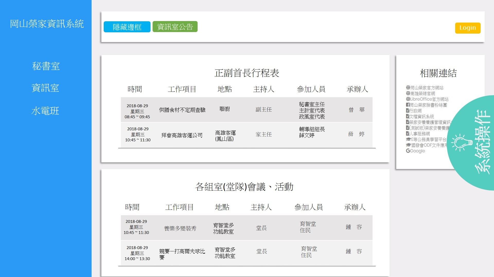
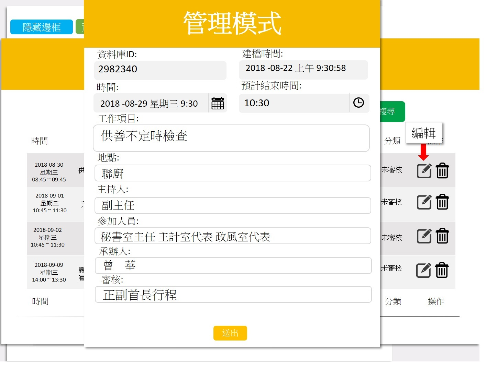
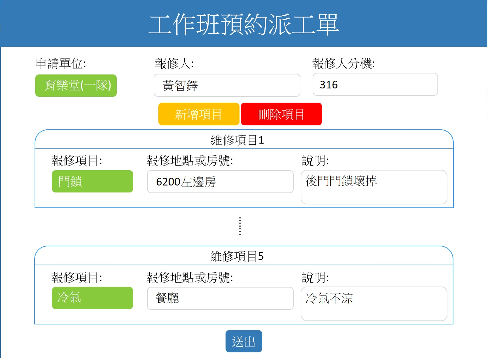
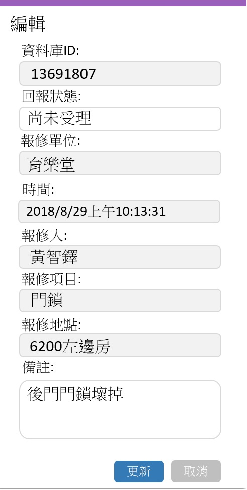
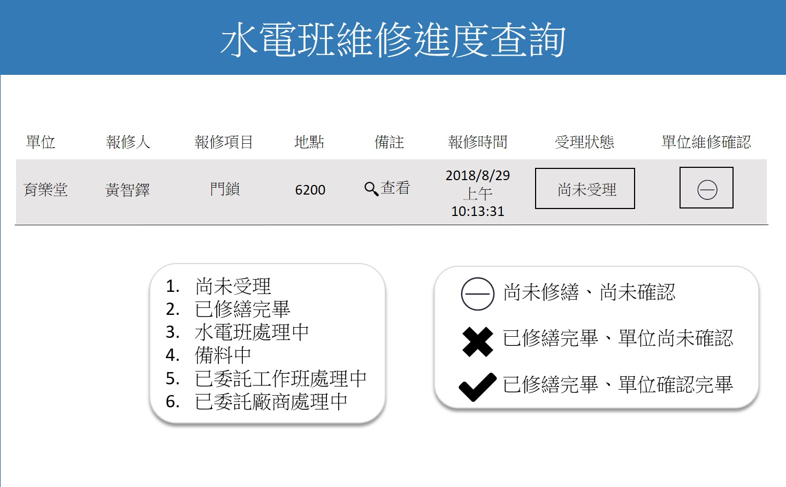

# 
岡山榮民之家資訊系統

### 功能

### 工作預定表　　　　　　　　　　　水電設備報修　　　　　　　　　資訊設備報修
  　· 線上填寫行程　　　　　　　　　　　　　　· 線上填寫報修　　　　　　　　　　　　· 線上填寫報修  
  　· 查詢每日行程　　　　　　　　　　　　　　· 線上回報維修確認　　　　　　　　　　· 查詢維修進度  
  　· 視覺化行程表　　　　　　　　　　　　　　· 查詢維修進度
  

  
### 管理 工作預定表　　　　　　　　　管理 水電設備報修　　　　　　　管理 資訊設備報修 
　· 過濾首長行程衝突　　　　　　　　　　　　· 線上更新維修進度　　　　　　　　　　· 線上更新維修進度  
　· 自動產生每日工作表　　　　　　　　　　　· 隨時掌握各堂隊維修項目　　　　　　　· 隨時掌握各堂隊維修項目　 
　· 匯出Word周/月/年表　　　　　　　　　　  · 匯出Word維修單　

### 語言
         C#
         
### 套件/(frameworks)
         ASP.net
         JS
         Html
         CSS
         Bootstrap
         
### 資料庫
         Mongo

## 首頁

## 行程表填寫與行程過濾警告

## 行程表管理模式

## 水電設備報修

## 水電設備報修管理模式

## 水電設備報修查詢

## 行程過濾警告程式碼
        ### 抓取首長當天行程所占用時間，建立一個當日Dictionary<string,bool> <紀錄時間每五分鐘一格,T or F> 6:00-17:05
        ### 判斷使用者新增的行程時間是否有為T為有空檔,F為沒空檔
        ### 有空則可新增行程,沒空告知有空檔的時間

        [WebMethod]
        public void Check_Director_host_ajax(string host_postition, string S_Begin_time, string S_End_time, int interval_time)
        {
            string End_time = convert_no0hour(S_End_time);

            string[] split_Begin_time = S_Begin_time.Split(' ');
            JavaScriptSerializer js = new JavaScriptSerializer();
            MongoDB_connection MDBC = new MongoDB_connection();
            var database = MDBC.MongoDB("Schedule_table");
            var collection_out = database.GetCollection<Schedule_table>("Schedule_table");
            var list = new List<Schedule_table>();
            list = collection_out.Find(x => x.S_host.Equals(host_postition) && x.S_time.Contains(split_Begin_time[0])).ToList()
                .Select(s => new Schedule_table
                {
                    Increment = s.Id.Increment,
                    S_time = s.S_time,
                    S_end_time = s.S_end_time,
                    Work_item = s.Work_item,
                    S_host = s.S_host,
                    Status = s.Status,
                    Local = s.Local,
                    Participants = s.Participants,
                    Duty = s.Duty,
                }).ToList();

            Dictionary<string, bool> TimeStatus = new Dictionary<string, bool>(); //未更新間隔的Dictionary
            for (int i = 6; i < 17; i++) //初始化6點到17點 每五分鐘建立一個dic欄位
            {
                for (int j = 0; j < 60; j = j + 5)
                {
                    string hour_str = i.ToString();
                    string min_str = j.ToString();
                    if (j < 10)
                    {
                        min_str = "0" + j.ToString();
                    }
                    if (i < 10)
                    {
                        hour_str = "0" + i.ToString();
                    }
                    TimeStatus.Add(hour_str.ToString() + ":" + min_str, true);
                    if (i == 16 && j == 55)
                    {
                        TimeStatus.Add((i + 1).ToString() + ":00", true);
                        TimeStatus.Add((i + 1).ToString() + ":05", false);
                    }
                }
            }

            List<string> Be_temp_hour = new List<string>();
            List<string> Be_temp_min = new List<string>();
            List<string> End_temp_hour = new List<string>();
            List<string> End_temp_min = new List<string>();
            List<int> Total_min = new List<int>();
            List<string> Schedule_time = new List<string>();
            List<Vaild_increment> Vail_list = new List<Vaild_increment>();

            List<string> output = new List<string>();
            List<int> session = new List<int>();

            for (int i = 0; i < list.Count; i++)//擷取時間
            {

                string[] temp = { };
                string[] Be_temp = { };
                string[] End_temp = { };
                string duty = list[i].Duty.Length > 10 ? list[i].Duty.Substring(10) + "...(詳情請查詢工作管制表) " : list[i].Duty + " ";
                temp = list[i].S_time.Split(' ');//切中文日期

                Be_temp = temp[2].Split(':');
                Be_temp_hour.Add(Be_temp[0]);
                Be_temp_min.Add(Be_temp[1]);

                End_temp = list[i].S_end_time.Split(':');
                End_temp_hour.Add(End_temp[0]);
                End_temp_min.Add(End_temp[1]);

                Schedule_time.Add(temp[2] + " - " + list[i].S_end_time + " " + duty + "<small class=" + '"' + "form-text text-muted" + '"' + ">" + "[ID:" + list[i].Increment + "]</small>  ");

                Vaild_increment vi = new Vaild_increment();
                vi.Id = list[i].Increment;
                vi.Sch_time = temp[2] + " - " + list[i].S_end_time;
                Vail_list.Add(vi);

                int total_time = (Convert.ToInt32(End_temp[0]) - Convert.ToInt32(Be_temp[0])) * 60
                    + (Convert.ToInt32(Be_temp[1]) > Convert.ToInt32(End_temp[1])
                    ? (Convert.ToInt32(Be_temp[1]) - Convert.ToInt32(End_temp[1])) : (Convert.ToInt32(End_temp[1]) - Convert.ToInt32(Be_temp[1])));
                Total_min.Add(total_time);

                //從資料庫的資料來Dictionary更新欄位
                for (int j = 0; j < Be_temp_hour.Count; j++)//讀取List裡面的時間
                {
                    int begin_hour = Convert.ToInt32(Be_temp_hour[j]);//Be_temp[0]
                    int begin_min = Convert.ToInt32(Be_temp_min[j]);//Be_temp[1]
                    int end_hour = Convert.ToInt32(End_temp_hour[j]);//End_temp[0]
                    int end_min = Convert.ToInt32(End_temp_min[j]);//End_temp[1]

                    int interval_endHour = 0;
                    int interval_endMin = 0;
                    if (interval_time % 60 == 0)//代表沒有分鐘需要 + 並且進位
                    {
                        interval_endHour = end_hour + (interval_time / 60);
                        interval_endMin = end_min;
                        if (interval_endHour >= 17)
                        {
                            interval_endHour = 17;
                            interval_endMin = 0;
                        }
                    }
                    else
                    {
                        interval_endHour = end_hour + ((end_min + interval_time) / 60);
                        interval_endMin = (end_min + interval_time) % 60;
                        if (interval_endHour >= 17)
                        {
                            interval_endHour = 17;
                            interval_endMin = 0;
                        }
                    }

                    for (int t = begin_hour; t <= interval_endHour; t++)
                    {
                        string t_temp = t < 10 ? "0" + t.ToString() : t.ToString();
                        if (t == interval_endHour)
                        {
                            for (int u = 0; u <= interval_endMin; u += 5)
                            {
                                TimeStatus[t_temp + ":" + (u < 10 ? "0" + u.ToString() : u.ToString())] = false;
                            }

                        }
                        else if (t != interval_endHour && t != begin_hour)
                        {
                            for (int u = 0; u < 60; u += 5)
                            {
                                TimeStatus[t_temp + ":" + (u < 10 ? "0" + u.ToString() : u.ToString())] = false;
                            }
                        }
                        else if (t == begin_hour)
                        {
                            for (int u = begin_min; u < 60; u += 5)
                            {
                                TimeStatus[t_temp + ":" + (u < 10 ? "0" + u.ToString() : u.ToString())] = false;
                            }
                        }

                    }
                  

                }
            }
          
            Context.Response.Write(js.Serialize(Chech_schedule_TorF(TimeStatus, split_Begin_time[2], End_time, Schedule_time.OrderBy(x => x).ToList(), Vail_list))); //標準輸出
           
        }

        private List<Feed_Back> Chech_schedule_TorF(Dictionary<string, bool> TorF_Dictionary, string begin_time, string end_time, List<string> Schedule_time, List<Vaild_increment> List_Vaild)
        {
            List<Feed_Back> Feed_back = new List<Feed_Back>();
            Feed_Back FB = new Feed_Back();
            string str_Schedule_time = "";
            FB.List_Vaild = List_Vaild;
            for (int i = 0; i < Schedule_time.Count; i++)
            {
                str_Schedule_time += Schedule_time[i];
            }

            if (TorF_Dictionary[begin_time].Equals(true))
            {
                if (TorF_Dictionary[end_time].Equals(true))
                {
                    FB.Time_TorF = true;
                    FB.Advice_Time = begin_time + "~" + end_time;
                    FB.Not_Advice_Time = str_Schedule_time;
                    Feed_back.Add(FB);

                    return Feed_back;
                }
                else //結束時間為false
                {
                    FB.Time_TorF = false;
                    FB.Advice_Time = Available_time(TorF_Dictionary);
                    FB.Not_Advice_Time = str_Schedule_time;
                    Feed_back.Add(FB);
                    return Feed_back;
                }
            }
            else //開始時間為false
            {
                FB.Time_TorF = false;
                FB.Advice_Time = Available_time(TorF_Dictionary);
                FB.Not_Advice_Time = str_Schedule_time;
                Feed_back.Add(FB);

                return Feed_back;
            }
        }
        
        public string Available_time(Dictionary<string, bool> TorF_Dictionary)
        {
            string result = "";
            List<string> Available_begin_time = new List<string>();
            List<string> Available_end_time = new List<string>();
            for (int i = 0; i < TorF_Dictionary.Count; i++)
            {
                if (TorF_Dictionary.ElementAt(i).Value == true)
                {
                    if (Available_begin_time.Count == 0)
                    {
                        Available_begin_time.Add(TorF_Dictionary.ElementAt(i).Key);
                    }
                }
                else
                {
                    if (Available_end_time.Count == 0 && Available_begin_time.Count > 0)
                    {
                        Available_end_time.Add(TorF_Dictionary.ElementAt(i - 1).Key);
                        result += Available_begin_time[0] + " - " + Available_end_time[0] + " ";
                        Available_begin_time = new List<string>();
                        Available_end_time = new List<string>();
                    }
                }
            }

            //輸出有空的時間 建議使用者
            return result;
        }

